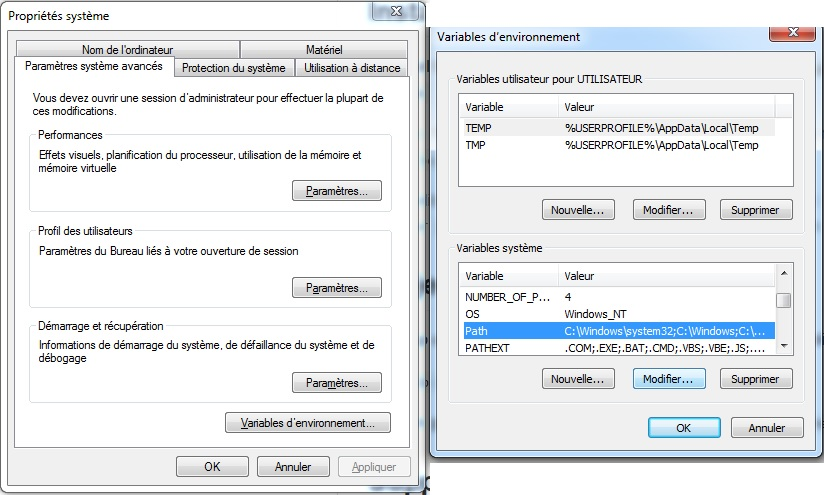
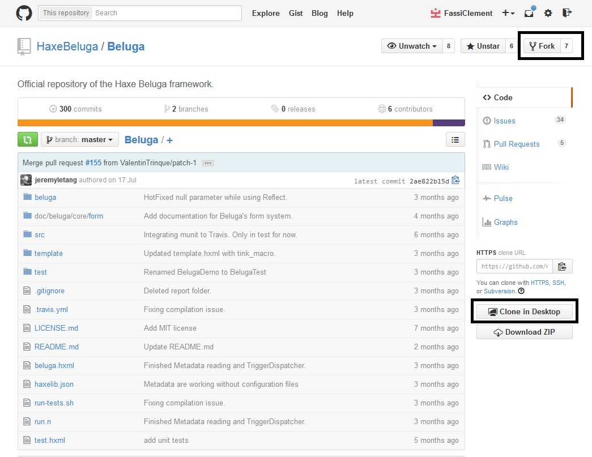
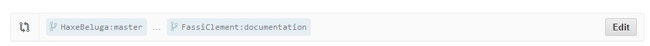

Comment récupérer le projet
========================

Voici les étapes pour récupérer notre projet depuis le site où il est hébergé (github.com) afin de le mettre sur votre ordinateur, en **local**.

Il existe plusieurs méthodes et je vais vous présenter celle qui requiert un client *github* car c'est un bon outil et il vous permettra de vous familiariser avec les lignes de commandes à connaitre absolument et ne pas utiliser d'interface graphique :

Il vous faudra tout d'abord télécharger des outils :

* un client [git](http://git-scm.com/) --> *qui dit Github dit Git*
* un client [github](https://windows.github.com) approprié à votre OS (Windows, Linux ...)
* [Haxe3](http://haxe.org/download) --> *Je vous rappelle que c'est le langage informatique de base de notre projet*

*Pour que le client git soit fonctionnel, recherchez les variables d’environnement de votre système avec la fonction "recherche" et modifiez la variable "Path" en ajoutant ceci à la fin :*
> ;C:\Program Files (x86)\Git\cmd

*(ou le chemin d’installation de git si vous ne l’avez pas laissé par défaut)*

Il vous faudra ensuite télécharger d'autres outils si vous comptez tester le projet et voir comment il fonctionne :

* un serveur web (comme Apache) --> *pour voir le projet et ce qu'il fait*

*Je vous conseille de télécharger un pack comme "Wamp" (pour Windows), "Samp" (pour Solaris), "Lama" (pour Linux) ou "Mamp" (pour Mac OSX) qui contient principalement le serveur Apache ainsi que la base de données MySQL qui est aussi un prérequis (voir ci-dessous).*

* une base de données « MySQL » --> *pour tester bien évidemment le système de connexion par exemple*

*(allez sur http://dev.mysql.com/downloads/windows/ et cliquez sur « MySQL Installer » pour les utilisateurs de Windows par exemple).
Pas la peine de le télécharger donc si vous avez téléchargé un pack juste avant cela puisqu'il contient déjà la base de données.*

Notre projet est actuellement hébergé sur Github, comme je l'ai dit précédemment, et accessible à l’adresse suivante: https://github.com/HaxeBeluga/Beluga.

Pour contribuer, il vous faut donc **forker** (faire une copie pour vous) le projet et le **cloner** sur votre poste de travail (afin qu'il soit disponible en **local**):

*Pour cela, cliquez sur l’option « Fork » en haut à droite de la page web et choisissez votre compte (que vous aurez préalablement créé si vous n'en aviez pas un avant, c'est rapide et gratuit !).
Allez ensuite sur le fork (via https://github.com/votre_nom_de_compte/Beluga) et cliquez sur « Clone in Desktop ». Cela va ouvrir votre client Github et vous demander l’endroit (le chemin d'accès en **local** donc) où installer le dépôt cloné.*

Et voilà, vous avez récupéré le projet sur votre machine et pouvez dès-à-présent voir le code en **local** !

Comment contribuer
=================

Pour contribuer au projet, c'est-à-dire ajouter un petit quelque chose ou faire des modifications, il faut intégrer vos modifications (ajout/modification de fichier/code) sur le dépôt principal de Beluga et donc utiliser les **pull requests**.
Bien sûr, inutile de proposer des fichiers de code non testés.

Par exemple pour ajouter un fichier en utilisant un **pull request**, voici la marche à suivre :
* Copiez votre fichier dans votre dépôt **local**
* Ouvrez une ligne de commande (la petite fenêtre noire) et tapez

> git add votre_fichier

* Tapez ensuite

> git commit -m "description_du_changement"

* Tapez enfin

> git push origin nom_de_votre_branche_locale_de_travail

(que vous aurez préalablement créé afin de ne pas travailler sur la branche principale et qui portera le nom que vous voulez)
* Allez sur votre fork sur github (https://github.com/votre_nom_de_compte/Beluga) et choississez votre branche de travail
* Cliquez sur le bouton à droite nommé "Compare, review, create a pull request" pour créer votre pull request qui sera ensuite examiné et validé/refusé par notre équipe !

Lors de la création votre **pull request**, vous devez choisir un répertoire de base et un répertoire de destination.

Le répertoire de base sera votre *fork* sur github et la branche associée sera celle où vous travaillez en **local**.

Le répertoire de destination sera *HaxeBeluga/Beluga* et la branche associée sera la branche **master**.

